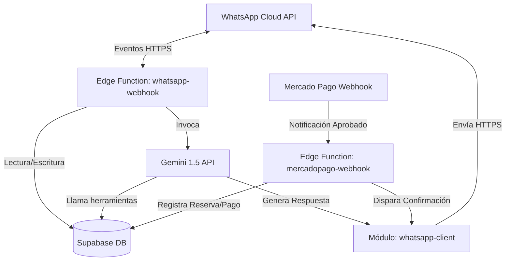

# Especificación Técnica: Agente de Ventas IA con Control Híbrido
### Integración: WhatsApp Business Cloud API + Mercado Pago + Supabase DB

Este documento sirve como la especificación técnica de referencia y manual de contexto para el desarrollo del módulo de ventas asistido por Inteligencia Artificial en **Khora**. Define la arquitectura, el modelo de datos, los flujos conversacionales, el mecanismo de control híbrido (human takeover) y el sistema de aprendizaje continuo para optimizar conversiones.

---

## 1. Visión General del Sistema
El objetivo de este módulo es capturar leads a través de WhatsApp Business, perfilarlos, responder consultas en lenguaje natural en tiempo real, agendar clases (de prueba, individuales o planes mensuales) y procesar pagos automáticos. El sistema garantiza que el administrador/profesor mantenga el control manual sobre las conversaciones mediante un panel integrado ("Live Chat"), pausando la IA cuando interviene un humano.



---

## 2. Arquitectura de Datos (Base de Datos)

Para implementar el sistema, se requieren tres nuevas tablas y la modificación de las tablas de negocio existentes en Supabase.

### 2.1. Nuevas Tablas de Chat y Control

#### A. `WhatsAppSession` (Sesión de Chat)
Lleva el estado de la conversación y del control del bot por número de teléfono.
```sql
CREATE TABLE public."WhatsAppSession" (
  id UUID PRIMARY KEY DEFAULT gen_random_uuid(),
  phone_number TEXT UNIQUE NOT NULL,       -- Número de teléfono en formato internacional (E.164)
  student_id UUID REFERENCES public."StudentProfile"(id) ON DELETE SET NULL, -- Vinculación si ya es alumno
  teacher_id UUID NOT NULL REFERENCES public."TeacherProfile"(id) ON DELETE CASCADE,
  bot_status TEXT NOT NULL DEFAULT 'ACTIVE' CHECK (bot_status IN ('ACTIVE', 'PAUSED', 'OFF')),
  paused_until TIMESTAMPTZ,                -- Apaga el bot temporalmente (ej. cuando chatea el humano)
  prospect_profile JSONB DEFAULT '{}'::jsonb, -- Perfil estructurado de intereses (nivel, objetivo, objeciones)
  created_at TIMESTAMPTZ DEFAULT NOW() NOT NULL,
  updated_at TIMESTAMPTZ DEFAULT NOW() NOT NULL
);
```

#### B. `WhatsAppHistory` (Historial de Mensajería)
Almacena el registro completo de la conversación para auditoría humana y contexto de la IA.
```sql
CREATE TABLE public."WhatsAppHistory" (
  id UUID PRIMARY KEY DEFAULT gen_random_uuid(),
  session_id UUID NOT NULL REFERENCES public."WhatsAppSession"(id) ON DELETE CASCADE,
  sender TEXT NOT NULL CHECK (sender IN ('CUSTOMER', 'BOT', 'HUMAN')),
  message_body TEXT,                       -- Contenido en texto plano o JSON si es multimedia
  meta_message_id TEXT,                    -- ID único entregado por Meta (para control de entrega)
  created_at TIMESTAMPTZ DEFAULT NOW() NOT NULL
);
CREATE INDEX idx_history_session ON public."WhatsAppHistory"(session_id, created_at ASC);
```

#### C. `SalesPlaybook` (Instrucciones Dinámicas del Agente)
Guarda la versión actual de la estrategia de ventas refinada por el Agente Analista.
```sql
CREATE TABLE public."SalesPlaybook" (
  id UUID PRIMARY KEY DEFAULT gen_random_uuid(),
  teacher_id UUID NOT NULL REFERENCES public."TeacherProfile"(id) ON DELETE CASCADE,
  version INTEGER DEFAULT 1 NOT NULL,
  playbook_content TEXT NOT NULL,          -- Instrucciones de ventas, manejo de objeciones y promociones del mes
  updated_by_agent BOOLEAN DEFAULT true NOT NULL,
  created_at TIMESTAMPTZ DEFAULT NOW() NOT NULL
);
```

---

## 3. Flujos de Trabajo e Integración

### 3.1. Flujo de Mensaje Entrante (`whatsapp-webhook`)

Cuando Meta notifica un mensaje en la Edge Function, se ejecutan los siguientes pasos:

1. **Autenticación y Validación:** Se verifica que el token de verificación coincida con el configurado en la consola de Meta y se valida la firma `X-Hub-Signature-256`.
2. **Obtención de Sesión:** Se busca la sesión por `phone_number` en `WhatsAppSession`. Si no existe, se crea asignándole el estado `ACTIVE`.
3. **Guardado en Historial:** Se inserta el mensaje del cliente en `WhatsAppHistory` con `sender = 'CUSTOMER'`.
4. **Validación de Pausa:**
   * Si `bot_status` es `OFF` o `PAUSED`, el webhook responde `200 OK` y finaliza (esperando que el humano responda desde el Live Chat).
   * Si `paused_until` es mayor que la hora actual, se omite la respuesta automática del bot.
5. **Generación de Respuesta (IA):**
   * Se recupera el historial reciente de `WhatsAppHistory` (últimos 15-20 mensajes).
   * Se consulta el `SalesPlaybook` activo para el profesor asociado.
   * Se invoca a la API de **Gemini 1.5 Flash**.
   * Si la respuesta requiere una acción de negocio (como verificar agenda o cotizar), la IA llama a una herramienta (Tool) correspondiente.
6. **Despacho del Mensaje:** La respuesta generada por la IA se envía a través de Meta y se guarda en `WhatsAppHistory` con `sender = 'BOT'`.

### 3.2. Mecanismo de Control Híbrido (Live Chat Takeover)

Para permitir que el humano intervenga y el bot guarde silencio inmediatamente:

```
[Mensaje saliente enviado por Profesor en Panel Khora]
                      |
                      v
       [Actualiza WhatsAppSession]
   bot_status = 'PAUSED'
   paused_until = NOW() + INTERVAL '30 minutes'
                      |
                      v
[Envía mensaje al alumno vía API de Meta]
```

1. **Bandeja de Entrada en Khora:** Se desarrolla una interfaz de Live Chat en Next.js. El profesor escribe en la caja de chat y presiona "Enviar".
2. **Trigger de Interrupción:** La acción de envío dispara una transacción en Supabase que automáticamente setea la sesión del chat en estado `PAUSED` por 30 minutos.
3. **Reanudación:** El temporizador se reinicia con cada mensaje nuevo del profesor. El profesor también puede hacer clic en un botón de la interfaz para reactivar inmediatamente el bot (`bot_status = 'ACTIVE'`).

---

## 4. Diseño del Agente de IA (Gemini 1.5)

El Agente de Ventas opera bajo un paradigma de **In-Context Learning** y **Tool Calling**.

### 4.1. Prompt Base del Agente (System Instructions)
El prompt principal del agente vendedor debe contener:
* **Identidad:** *"Eres Sofía, la asistente virtual de la academia de [Nombre Profesor]. Hablas de manera empática, breve y persuasiva."*
* **Objetivos del Embudo:**
  1. Identificar si el cliente quiere una clase de prueba, unitaria o plan mensual.
  2. Responder dudas frecuentes de precios y modalidad (online/presencial).
  3. Agendar el horario y guiar hacia el enlace de pago de Mercado Pago.
* **Manejo de Objeciones:** Basado en el `SalesPlaybook` dinámico inyectado en el contexto.

### 4.2. Herramientas Disponibles (Tools / Function Calling)
* `check_availability(teacher_id, date)`: Consulta bloques disponibles en la base de datos de Khora.
* `generate_payment_link(teacher_id, email, phone, name, item_type, selected_date, selected_slot)`: Llama a la Edge Function `mercadopago-checkout` y genera el link de cobro con la metadata de la reserva pre-aprobada.

---

## 5. El Bucle de Aprendizaje y Optimización (Feedback Loop)

Para lograr que el agente aprenda qué estrategias convierten mejor:

### 5.1. Etiquetado de Conversiones
* **Conversión Exitosa:** Se activa mediante el webhook de Mercado Pago. Cuando se aprueba un pago y se confirma una clase, se marca la sesión con `prospect_profile->>'converted' = 'true'`.
* **Conversión Fallida:** Un cron job analiza las sesiones inactivas por más de 72 horas que no registraron un pago y las marca como `converted = 'false'`.

### 5.2. El Agente Analista (Proceso Offline Semanal)
Un script programado en Supabase Edge Functions (ej. `analyze-sales-patterns`) ejecuta una instancia de **Gemini 1.5 Pro** semanalmente:
1. Extrae los logs completos de chats convertidos y chats fallidos.
2. Analiza qué palabras, objeciones (ej. *"me parece caro"*, *"no tengo tiempo"*) o ganchos de conversación llevaron al éxito o al rebote.
3. Genera un reporte analítico de patrones y **sobrescribe** el `playbook_content` de la tabla `SalesPlaybook`.
4. El agente vendedor, al recibir el siguiente mensaje, utiliza esta nueva versión de la estrategia.

---

## 6. Configuración del Ambiente de Pruebas (Sandbox)

Para trabajar de manera aislada y segura, el entorno de pruebas requiere:

1. **Meta Sandbox:**
   * Ir al portal de Meta for Developers.
   * Crear una App de tipo "Business" y agregar el producto **WhatsApp**.
   * Meta entregará un *Test Phone Number ID* y un *Temporary Access Token*.
   * Registrar los teléfonos de prueba del equipo de desarrollo como "destinatarios autorizados".
2. **Conexión Local (Webhook Tunneling):**
   * Levantar las Edge Functions de Supabase de manera local: `supabase start` y `supabase functions serve`.
   * Exponer el puerto local de webhooks usando **ngrok**: `ngrok http 54321`.
   * Copiar la URL HTTPS generada por ngrok en la consola de configuración de Webhooks de Meta (campo *Callback URL*).
3. **Simulador de Pagos:**
   * Utilizar la clave `mp_sandbox_token` en `TeacherBillingConfig`.
   * Realizar los flujos de cobro en WhatsApp usando las tarjetas de crédito de prueba de la documentación oficial de Mercado Pago.
